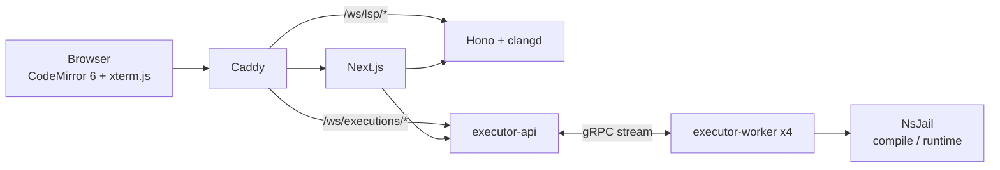

# アーキテクチャ

## 目的

このプロジェクトは、ブラウザで `main.c` を編集し、clangdによる補完・診断と、標準入出力を使った対話実行を提供します。C言語以外、複数ファイル、完全なシェル端末は扱いません。

## サービス境界

| サービス        |             ポート | 責務                                                 |
| --------------- | -----------------: | ---------------------------------------------------- |
| Caddy           | 80/443、開発時8080 | TLS、同一オリジン、WebSocket中継                     |
| web             |               3000 | UI、公開REST BFF、匿名visitor Cookie、作成レート制限 |
| lsp             |               3001 | 一時workspace、clangd、LSP WebSocket                 |
| executor-api    |         4000/50051 | 実行セッション、WebSocket、キュー、Worker割当        |
| executor-worker |     外部ポートなし | コンパイル、PTY、NsJail、resource limit、cleanup     |

## LSPフロー

1. ブラウザが現在のソースを `POST /api/lsp/sessions` へ送ります。
2. Next.jsはvisitorと接続元IPを追加して、Honoの内部APIへ転送します。
3. Honoはtmpfsに `main.c` と固定の `compile_flags.txt` を作ります。
4. Next.jsはHonoが発行した30秒・一回限りのticketをHttpOnly Cookieへ設定します。
5. CodeMirror LSP Clientは同一オリジンの `/ws/lsp/{id}` へ接続します。
6. Honoはclangdを起動し、WebSocket JSON-RPCと標準入出力を相互転送します。
7. 切断、アイドル期限、絶対期限のいずれでもclangdとworkspaceを削除します。

## 実行フロー

1. ブラウザがコードと端末サイズを `POST /api/executions` へ送ります。
2. Next.jsとexecutor-apiがサイズ、レート、同時実行数を検証します。
3. executor-apiは短命ticketを発行し、WebSocket接続後にジョブをキューへ入れます。
4. 空きWorkerがcompile jailでClang C17を実行し、利用者の `main.o` とWorkerイメージ内の信頼済み `runtime-support.o` を静的リンクして、静的実行ファイルを生成します。
5. `runtime-support.o` のconstructorが `main` より前にruntime stdoutを無バッファ化した後、別のruntime jailでPTYへ接続して実行します。
6. binary WebSocket frameは端末bytes、text frameはphase・終了・制御JSONとして扱います。
7. 終了、停止、切断、制限超過の全経路でプロセスグループとworkspaceを破棄します。

## 意図的な制約

- LSPの診断は事前ヒントであり、実行可否を決めません。
- stdoutとstderrはPTY上で統合され、実際に表示された順序を優先します。
- stdoutの無バッファ化は静的実行ファイル内だけで完結し、REST、WebSocket、gRPCの契約とPTYの入出力境界は変更しません。
- stdoutのバッファ方式は実行環境が所有し、利用者コードによる再設定後の挙動は保証しません。
- WebSocketの再接続は行いません。切断された実行は中止します。
- サーバーへコード、入力、出力、履歴を保存しません。
- 開発用のdirect backendは公開環境では使用できません。
